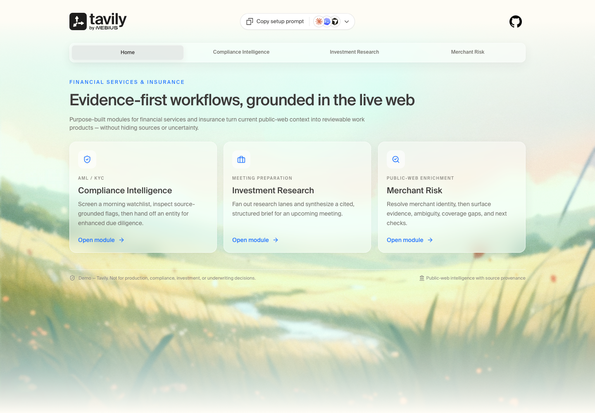
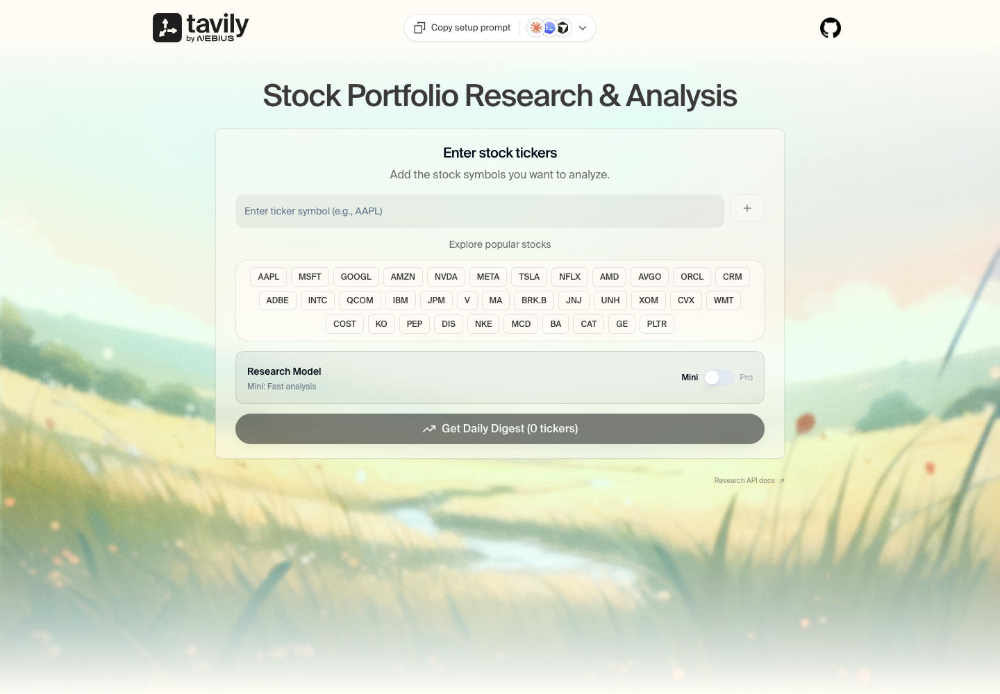
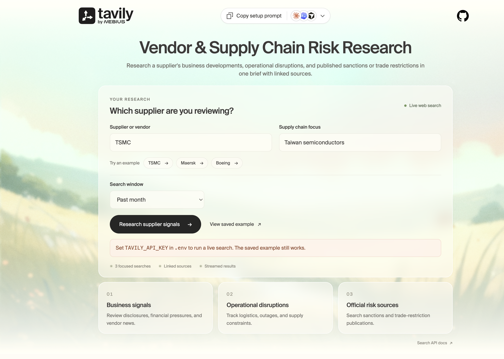
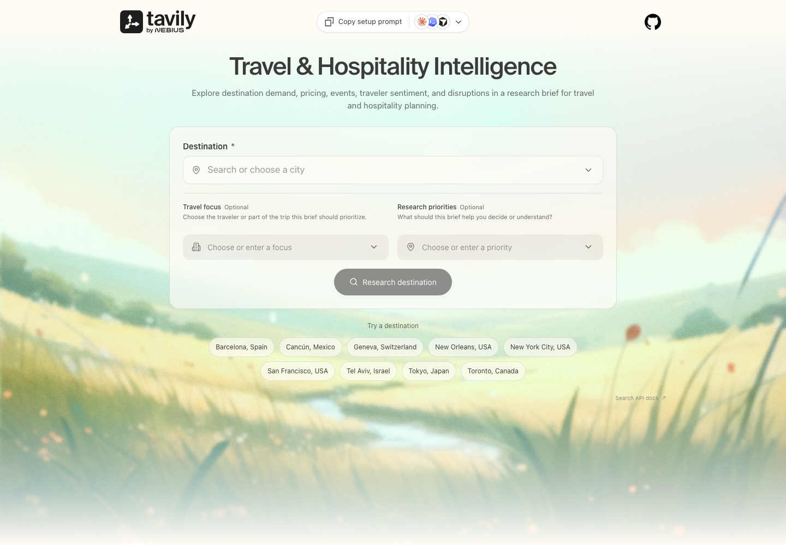

<p align="center">
  <a href="https://www.tavily.com">
    <picture>
      <source media="(prefers-color-scheme: dark)" srcset="assets/tavily-primary-logo-white.png">
      
    </picture>
  </a>
</p>

<h1 align="center">Industry Demos</h1>

<p align="center">
  Self-contained demo kits showcasing agentic workflows built with <a href="https://tavily.com">Tavily</a>, organized by industry and use case.
</p>

<p align="center">
  <a href="https://tavily.com"></a>
  <a href="LICENSE"></a>
  
</p>

---

> **Customizable starters** These kits are designed for you to adapt their prompts, schemas, sources, models, policies, UI, and controls to your use case. Validate generated results and add appropriate safeguards before production use.

**Every folder is a complete, runnable project.** Grab just the kit you want — it has its own backend, frontend, environment setup, and docs.

## Kits

<table>
  <tr>
    <td align="center" valign="top" width="50%">
      <a href="fsi-kit/"></a><br>
      <a href="fsi-kit/"><strong>fsi-kit</strong></a><br>
      Financial Services &amp; Insurance — compliance, investment research, and merchant-risk intelligence
    </td>
    <td align="center" valign="top" width="50%">
      <a href="sales-meeting-prep/"></a><br>
      <a href="sales-meeting-prep/"><strong>sales-meeting-prep</strong></a><br>
      Sales &amp; GTM — web-sourced meeting briefs and customer context
    </td>
  </tr>
  <tr>
    <td align="center" valign="top" width="50%">
      <a href="company-research-agent/"></a><br>
      <a href="company-research-agent/"><strong>company-research-agent</strong></a><br>
      Product &amp; Competitive Intelligence — company briefings and market research
    </td>
    <td align="center" valign="top" width="50%">
      <a href="market-researcher/"></a><br>
      <a href="market-researcher/"><strong>market-researcher</strong></a><br>
      Finance — cited stock portfolio and investment research
    </td>
  </tr>
  <tr>
    <td align="center" valign="top" width="50%">
      <a href="vendor-supply-chain-risk/"></a><br>
      <a href="vendor-supply-chain-risk/"><strong>vendor-supply-chain-risk</strong></a><br>
      Risk — vendor events and supply-chain disruptions
    </td>
    <td align="center" valign="top" width="50%">
      <a href="travel-hospitality-intelligence-agent/"></a><br>
      <a href="travel-hospitality-intelligence-agent/"><strong>travel-hospitality-intelligence-agent</strong></a><br>
      Travel &amp; Hospitality — destination trends, demand, and disruptions
    </td>
  </tr>
  <tr>
    <td align="center" valign="top" width="50%">
      <a href="tavily-chat/"></a><br>
      <a href="tavily-chat/"><strong>tavily-chat</strong></a><br>
      AI Assistants — streaming web-grounded chat with citations
    </td>
    <td></td>
  </tr>
</table>

## Use a kit

Each kit is self-contained. To take just one:

```bash
# Easiest — copies one folder, no git history
npx degit tavily-ai/tavily-industry-demos/fsi-kit my-demo
```

Or with git sparse checkout:

```bash
git clone --filter=blob:none --sparse https://github.com/tavily-ai/tavily-industry-demos
cd tavily-industry-demos
git sparse-checkout set fsi-kit
```

Then follow the kit's own README — for example, [fsi-kit/README.md](fsi-kit/README.md).

For any other demo, replace `fsi-kit` above with its folder name, then `cd` into that folder before following its README. Install dependencies and build from the individual demo directory. Docker build contexts and deployment root directories must also point to that demo's folder. Demos may use the same default ports; run them separately or configure different ports.

## License

[MIT](LICENSE)
