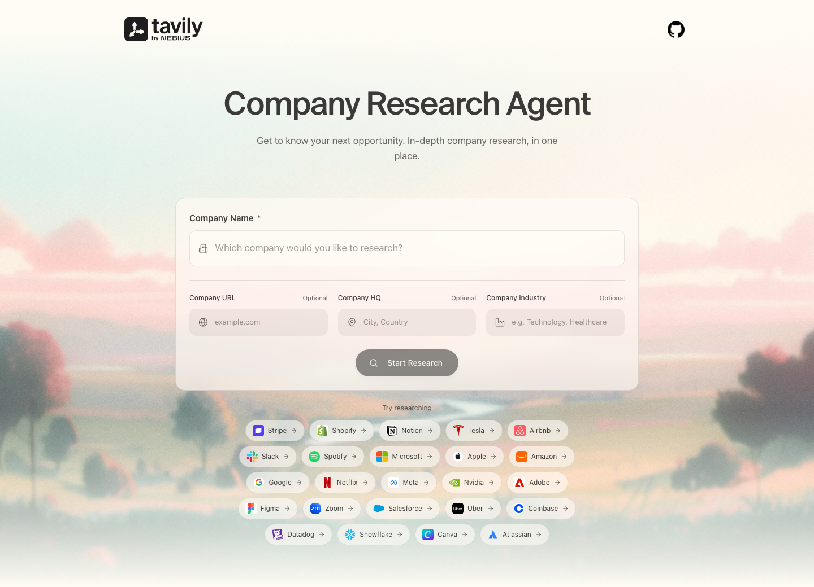

# Company Research Agent

An agentic research tool that turns a company name into a structured, source-backed briefing. The FastAPI backend coordinates specialized research and synthesis steps; the React interface tracks the job and lets you export the finished report as a PDF.



## What it does

- Researches a company’s business, industry, financial context, and recent news.
- Uses Tavily search and relevance scoring to find and curate source material.
- Synthesizes category briefings with Gemini and produces the final report with OpenAI models.
- Streams research progress to the browser and supports PDF export.
- Optionally persists jobs and reports in MongoDB.

## Architecture

```text
React + Vite UI
      │  POST /research
      ▼
FastAPI application
      │
      ▼
Research graph
  analyzers → collector → curator → briefing → editor
      │
      ├── Tavily: research and relevance scoring
      ├── Gemini: briefing synthesis
      └── OpenAI: research tasks and final editing
```

The UI connects to the API with `VITE_API_URL` and receives incremental updates from `GET /research/{job_id}/stream`.

## Prerequisites

- Python 3.11 or later
- Node.js 18 or later
- Google Gemini and OpenAI API keys for the backend
- A Tavily API key entered in the app for each research session (or a backend fallback key)
- A Google Maps API key only if you want location autocomplete
- MongoDB only if you want persistent jobs and reports

## Run locally

1. Create a virtual environment and install the backend dependencies:

   ```bash
   uv venv .venv
   uv pip install -r requirements.txt
   ```

   If you do not use `uv`, create the environment with `python -m venv .venv` and install with `pip install -r requirements.txt`.

2. Create `.env` from the example and set the required backend keys:

   ```bash
   cp .env.example .env
   ```

   ```env
   GEMINI_API_KEY=your_gemini_key
   OPENAI_API_KEY=your_openai_key
   # Optional fallback when no per-session Tavily key is supplied
   TAVILY_API_KEY=your_tavily_key
   # MONGODB_URI=optional_mongodb_connection_string
   ```

3. Configure the frontend:

   ```bash
   cp ui/.env.development.example ui/.env.development.local
   cd ui && npm install && cd ..
   ```

   Set `VITE_API_URL=http://localhost:8000` in `ui/.env.development.local`. Add `VITE_GOOGLE_MAPS_API_KEY` only when location autocomplete is needed.

4. Start the API in one terminal:

   ```bash
   .venv/bin/uvicorn application:app --reload --port 8000
   ```

5. Start the UI in a second terminal:

   ```bash
   cd ui
   npm run dev
   ```

Open [http://localhost:5174](http://localhost:5174). The API is available at [http://localhost:8000/docs](http://localhost:8000/docs).

## Docker

After creating the root `.env` and `ui/.env.development.local` files, run:

```bash
docker compose up --build
```

This exposes the API on port `8000` and the UI on port `5174`.

## API

| Method | Endpoint | Purpose |
| --- | --- | --- |
| `POST` | `/research` | Start a research job. |
| `GET` | `/research/{job_id}/stream` | Receive server-sent progress and completion events. |
| `GET` | `/research/{job_id}/report` | Retrieve a completed report. |
| `POST` | `/generate-pdf` | Generate a PDF from report Markdown. |
| `GET` | `/research/pdf/{filename}` | Download a generated PDF. |

Example request:

```bash
curl -X POST http://localhost:8000/research \
  -H 'Content-Type: application/json' \
  -d '{
    "company": "Tavily",
    "company_url": "https://tavily.com",
    "industry": "AI search",
    "hq_location": "New York, USA"
  }'
```

## Configuration reference

| Variable | Required | Used by |
| --- | --- | --- |
| `TAVILY_API_KEY` | No | Backend fallback for research and curation; visitors can supply their own key in the UI |
| `GEMINI_API_KEY` | Yes | Backend briefing synthesis |
| `OPENAI_API_KEY` | Yes | Backend research and report editing |
| `MONGODB_URI` | No | Backend job/report persistence |
| `VITE_API_URL` | Yes | Frontend API connection |
| `VITE_GOOGLE_MAPS_API_KEY` | No | Frontend location autocomplete |

## License

[MIT](LICENSE)
