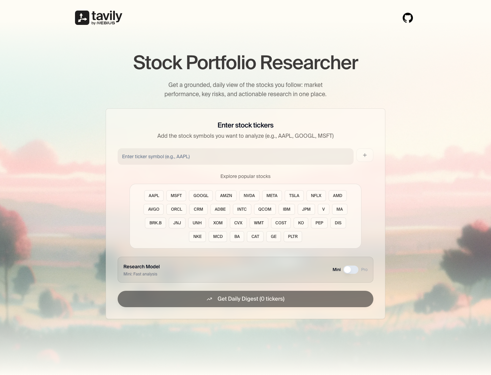

# Stock Portfolio Researcher

An agentic research tool that turns a small stock portfolio into a sourced daily digest. The FastAPI backend runs Tavily Research per ticker and OpenAI metric extraction; the React interface streams live progress and lets you export the finished report as a PDF.



Live research uses `TAVILY_API_KEY` and `OPENAI_API_KEY` on the server. The browser never sees or sends a key.

## What it does

- Research up to five tickers at a time from a curated picker or a custom symbol.
- Stream live Tavily Research activity to the interface, including planning, searches, and report generation.
- Produce structured per-stock reports: current performance, key insights, risk assessment, recommendation, and price outlook.
- Enrich reports with finance-oriented Search results and OpenAI structured extraction for metrics such as current price, CAGR, Sharpe ratio, drawdown, and two-year highs/lows.
- Show source links, company icons, and export the completed digest as a PDF.

## Architecture

```text
React form → POST /api/stock-digest/stream → Tavily Research (up to 5 tickers)
           ← real SSE events  ← Tavily Search + OpenAI metric extraction
```

The backend starts up to five Tavily Research streams concurrently, forwards their interleaved planning/search/report events to the browser, and sends the completed structured digest as the final event.

Tavily Research receives a JSON schema generated from the `StockReport` Pydantic model. The current streaming event flow follows Tavily's [Research streaming documentation](https://docs.tavily.com/documentation/api-reference/endpoint/research-streaming).

The UI connects to the API with `VITE_API_URL`. Stopping a run aborts the in-flight request.

## Prerequisites

- [uv](https://docs.astral.sh/uv/) (Python 3.11 or later)
- Node.js 18 or later
- Tavily and OpenAI API keys on the backend

## Run locally

1. Install backend dependencies:

   ```bash
   uv sync
   ```

2. Create `.env` from the example and set the required backend keys:

   ```bash
   cp .env.example .env
   ```

   ```env
   TAVILY_API_KEY=your_tavily_key
   OPENAI_API_KEY=your_openai_key
   ```

3. Configure the frontend:

   ```bash
   cp UI/.env.development.example UI/.env.development.local
   cd UI && npm ci && cd ..
   ```

   Set `VITE_API_URL=http://localhost:8080` in `UI/.env.development.local`.

4. Start the API in one terminal:

   ```bash
   uv run uvicorn application:app --reload --port 8080
   ```

5. Start the UI in a second terminal:

   ```bash
   cd UI
   npm run dev
   ```

Open [http://localhost:3000](http://localhost:3000). The API is available at [http://localhost:8080/docs](http://localhost:8080/docs).

From `UI/`, `npm run lint` and `npm run fmt:check` run oxlint and oxfmt.

## Docker

After creating the root `.env` and `UI/.env.development.local` files, run:

```bash
docker compose up --build
```

This exposes the API on port `8080` and the UI on port `3000`.

## API

| Method | Endpoint | Purpose |
| --- | --- | --- |
| `GET` | `/health` | Readiness and whether server keys are configured, never the keys themselves. |
| `POST` | `/api/stock-digest/stream` | Run research and stream SSE events on the same response. |
| `POST` | `/api/stock-digest` | Non-streaming JSON digest for direct API consumers. |

Example request:

```bash
curl -N -X POST http://localhost:8080/api/stock-digest/stream \
  -H 'Content-Type: application/json' \
  -d '{
    "tickers": ["AAPL", "MSFT"],
    "research_model": "mini"
  }'
```

`POST /api/stock-digest/stream` returns `text/event-stream` with named `progress`, `complete`, and `error` events. Missing keys and invalid input return JSON errors before opening a stream. Stopping a search aborts in-flight work, although work already accepted by Tavily or OpenAI may still consume credits.

Research can take a few minutes, particularly when using the `pro` model. Financial information is generated from live web research and should be independently verified before making investment decisions.

## Configuration reference

| Variable | Required | Used by |
| --- | --- | --- |
| `TAVILY_API_KEY` | Yes | Backend Research and Search |
| `OPENAI_API_KEY` | Yes | Backend metric extraction |
| `VITE_API_URL` | Yes | Frontend API connection |

## Make it yours

This folder is a complete app. Copy it, then change:

- `UI/src/components/TickerInput.tsx` — ticker picker and research model toggle
- `backend/prompts.py` — research and metric-extraction prompts
- `backend/models.py` — report schema sent to Tavily Research
- `backend/agent.py` — Tavily Research, Search, and OpenAI assembly
- `application.py` — HTTP API and SSE streaming
- `UI/src/` — UI

No other kit is required:

```bash
npx degit tavily-ai/tavily-industry-demos/market-researcher my-demo
```

Included brand assets and Suisse fonts do not grant a separate trademark or font redistribution license.

## License

[MIT](LICENSE)
