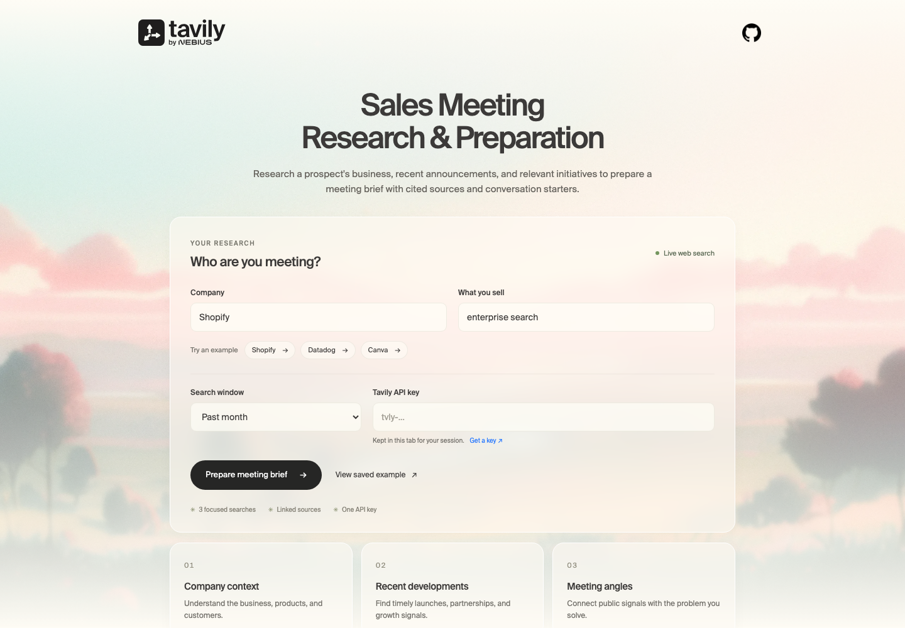

# Sales Meeting Prep



Walk into your next meeting with current company context, recent developments, and questions worth asking.

A small, standalone React + Node.js demo of **Tavily Search**. One form starts three focused searches in parallel and streams real completion events to the browser. Live search uses `TAVILY_API_KEY` on the server — the browser never sees or sends a key.

## What it covers

1. **Company context:** Understand the business, products, and customers.
2. **Recent developments:** Find timely launches, partnerships, and growth signals.
3. **Meeting angles:** Connect public signals with the problem you solve.

The brief includes source excerpts, publication/update dates when available, a complete list of source links, suggested follow-up questions, and Markdown export. Concise summaries come from the Search endpoint’s `include_answer: "basic"` option.

## Run locally

Requires **Node.js 24 or newer**.

```bash
cp .env.example .env   # set TAVILY_API_KEY
npm ci
npm run dev
```

Open [localhost:3000](http://localhost:3000). Choose **View saved example** for a key-free walkthrough, or run a live search once `TAVILY_API_KEY` is set. Example chips populate the form; they do not trigger API calls. To use another port: `PORT=3001 npm run dev`.

## How Tavily is used

```text
React form → POST /api/research → 3 concurrent Tavily Search requests
           ← real SSE events  ← completed sources and errors
```

The upstream Search endpoint returns JSON. This application emits its own SSE events around real request starts and completions; it does not simulate progress or use the Tavily Research endpoint.

- Short queries, `search_depth: "advanced"`, up to ten results, and 4 content chunks per source.
- `include_favicon: true` so each source can show its site icon.
- Time-sensitive searches use the chosen window. Company context is evergreen (any time).
- Duplicate URLs are removed. Search scores are relevance signals, not proof of a fact or identity.
- Each advanced search currently uses two credits, so a completed brief normally uses six. The UI displays reported usage; saved examples make no API calls. See the [Search API documentation](https://docs.tavily.com/documentation/api-reference/endpoint/search) for current behavior and parameters.

One real request for this demo:

```json
{
  "query": "Shopify company overview business model products",
  "search_depth": "advanced",
  "max_results": 10,
  "chunks_per_source": 4,
  "topic": "general",
  "include_answer": "basic",
  "include_favicon": true,
  "include_usage": true
}
```

## API and streaming

`GET /api/health` returns readiness and whether a server key is configured, never the key itself.

`POST /api/research` accepts:

```json
{
  "entity": "Shopify",
  "context": "enterprise search",
  "timeRange": "month"
}
```

It returns `text/event-stream` with JSON `data:` frames: `plan`, `search`, `result`, `search-error`, and `complete`. A completion report is explicitly `complete`, `partial`, or `failed`. Missing `TAVILY_API_KEY` and invalid input return JSON errors before opening a stream. The browser surfaces truncated streams and keeps successful sections after a partial failure. Stopping a search aborts in-flight upstream requests, although work already accepted by Tavily may still consume credits. Requests time out after 60 seconds.

## Build, test, and run

```bash
npm test
npm run lint
npm run fmt:check
npm run build
npm start
```

The tests use mock upstream responses and cover parallel execution, stream framing, cancellation, validation, partial failures, empty results, safe source URLs, and credential redaction. They do not consume API credits.

For a container:

```bash
docker build -t sales-meeting-prep .
docker run --rm -p 3000:3000 -e TAVILY_API_KEY="$TAVILY_API_KEY" sales-meeting-prep
```

Live search requires `TAVILY_API_KEY` in the environment. The local server binds to `127.0.0.1`; Docker binds to `0.0.0.0`. This is a demo without user authentication or persistent storage. Put a shared-key deployment behind your own authentication and HTTPS. Per-process concurrency and short request throttles are included, but are not an account-level quota system. Set `HOST` and `PORT` for your deployment environment.

## Make it yours

This folder is a complete app. Copy it, then change:

- `demo.config.mjs` — title, form fields, example chips, search queries, and follow-up questions
- `server/research.mjs` — Tavily Search calls and how the brief is assembled
- `server/index.mjs` — HTTP API, stream forwarding, and static serving
- `src/main.jsx` and `src/style.css` — UI
- `public/sample-report.json` — the saved example (visibly labeled; no live API calls)

No other kit is required:

```bash
npx degit tavily-ai/tavily-industry-demos/sales-meeting-prep my-demo
```

Included brand assets and Suisse fonts do not grant a separate trademark or font redistribution license.

## Scope

Conversation starters are suggested questions, not verified customer needs. Company context uses any-time search; the selected window applies to developments and meeting angles.

The follow-up questions are deterministic prompts to explore, not generated findings. The app does not run a scheduler, send notifications, or make decisions for the user.

## License

[MIT](LICENSE)
