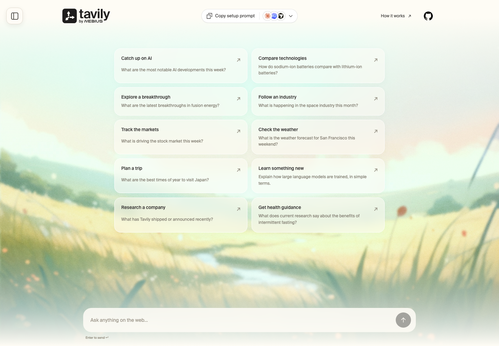

# Tavily Chat



A simple chat demo with live web search, streaming answers, and visible sources.

A small, standalone React + Node.js demo of **Tavily Search**. Each question plans two complementary searches, then streams an OpenAI answer with numbered citations. Live chat uses `TAVILY_API_KEY` and `OPENAI_API_KEY` on the server — the browser never sees or sends a key.

## What it covers

- Conversational follow-ups grounded in fresh web search.
- Actual planning, search queries, source discovery, and streamed answer chunks.
- Markdown lists, code blocks, and horizontally scrollable tables.
- Numbered citation links and a visible source list under each answer.
- Suggested questions, stop/retry controls, and a left-side chat history panel with new-chat, reopen, and delete actions.

Enter sends a message; Shift+Enter inserts a line break. The left-side chat panel saves conversations in this browser, so they can be reopened after a refresh. Starting a new chat preserves older chats; delete one from the panel when it is no longer needed. While an answer is running, use Stop to cancel the local stream.

## Run locally

Requires **Node.js 24 or newer**.

```bash
cp .env.example .env   # set TAVILY_API_KEY and OPENAI_API_KEY
npm ci
npm run dev
```

Open [localhost:3000](http://localhost:3000). Choose a suggested question or type your own. To use another port: `PORT=3001 npm run dev`.

## How Tavily is used

```text
React chat → POST /api/chat → OpenAI: focused search tool call
                           → Tavily /search (fast, up to ten results per query)
                           → OpenAI: streamed answer with numbered citations
           ← SSE activity, sources, answer text, completion
```

The upstream Search endpoint returns JSON. This application emits its own SSE events around real request starts and completions; it does not simulate progress or use the Tavily Research endpoint.

Each request includes the latest question and up to three completed question/answer pairs. OpenAI resolves follow-up references into two complementary queries for primary evidence and independent corroboration. The server executes two Tavily Search calls in parallel, with topic-specific primary publisher domains on the first query, then returns bounded source excerpts to OpenAI with further tool calls disabled. The default model is GPT-5.6 Luna; Responses API requests use `store: false`.

Search uses `search_depth: "advanced"`, without Tavily-generated answers or raw page content. The answer streams as OpenAI produces it. A 90-second overall timeout and a 2,000-token answer limit bound each turn.

Tracking parameters and fragments are removed for deduplication. Up to eight sources are selected with at most two pages per publisher, preserving relevance order within each publisher. This is a diversity heuristic, not a credibility guarantee. Source IDs are assigned before synthesis and shared by the model and UI. Unsafe URLs are removed without shifting remaining IDs. Empty search results tell the model to acknowledge missing evidence. Citations indicate model attribution; the app does not independently verify every claim.

One real request for this demo:

```json
{
  "query": "sodium-ion batteries compared with lithium-ion",
  "search_depth": "advanced",
  "max_results": 10,
  "chunks_per_source": 3,
  "topic": "general",
  "include_answer": false,
  "include_raw_content": false
}
```

## API and streaming

`GET /api/health` returns readiness and whether each provider’s server key is configured, never the key itself.

`POST /api/chat` accepts:

```json
{
  "message": "How does that compare with lithium-ion?",
  "history": [
    { "role": "user", "content": "What is a sodium-ion battery?" },
    { "role": "assistant", "content": "A previous completed answer." }
  ]
}
```

It returns `text/event-stream` with JSON `data:` frames: `activity`, `discovery`, `content`, `sources`, `complete`, and `error`. Missing keys and invalid input return JSON errors before opening a stream. Disconnecting the browser aborts the upstream HTTP connection. Either provider may already have incurred usage; stopping the local stream does not guarantee cancellation of provider billing.

A question can contain up to 2,000 characters. The browser stores conversations locally; requests send at most six previous messages from the active chat. Failed and stopped answers are excluded from follow-up context.

## Build, test, and run

```bash
npm test
npm run lint
npm run fmt:check
npm run build
npm start
```

The tests use mock upstream responses and cover parallel execution, stream framing, cancellation, validation, citations, and credential redaction. They do not consume API credits.

For a container:

```bash
docker build -t tavily-chat .
docker run --rm -p 3000:3000 --env-file .env tavily-chat
```

Live chat requires `TAVILY_API_KEY` and `OPENAI_API_KEY` in the environment. The local server binds to `127.0.0.1`; Docker binds to `0.0.0.0`. This is a demo without user authentication or persistent storage. Put a shared-key deployment behind your own authentication and HTTPS. Per-process concurrency and short request throttles are included, but are not an account-level quota system. Set `HOST` and `PORT` for your deployment environment.

## Configuration

| Setting                              | Purpose                                                                         |
| ------------------------------------ | ------------------------------------------------------------------------------- |
| `TAVILY_API_KEY`                     | Server-side Tavily Search key.                                                  |
| `OPENAI_API_KEY`                     | Server-side OpenAI key.                                                         |
| `OPENAI_MODEL`                       | Responses-compatible model with function calling; default `gpt-5.6-luna`.       |
| `PORT`                               | Server port, default `3000`.                                                    |
| `HOST`                               | Bind address, default `127.0.0.1`; containers use `0.0.0.0`.                    |
| [`demo.config.mjs`](demo.config.mjs) | Suggested questions, default OpenAI model, 90-second timeout, and input limits. |

## Make it yours

This folder is a complete app. Copy it, then change:

- `demo.config.mjs` — title, suggested questions, default model, and input limits
- `server/chat.mjs` — Tavily Search calls, OpenAI tool harness, and answer assembly
- `server/index.mjs` — HTTP API, stream forwarding, and static serving
- `src/main.jsx` and `src/style.css` — UI
- `public/sample-chat.json` — a saved example conversation

No other kit is required:

```bash
npx degit tavily-ai/tavily-industry-demos/tavily-chat my-demo
```

Included brand assets and Suisse fonts do not grant a separate trademark or font redistribution license.

## Scope

The server applies a request size bound, a short per-IP cooldown, and a two-request concurrency cap. It rejects browser cross-origin requests and renders Markdown without raw HTML or remote images.

Questions and recent conversation context are sent to OpenAI. The generated search query is sent to Tavily; source excerpts are returned to OpenAI. Conversations are stored locally in the browser, not in a database, analytics, or application logs.

Search calls consume Tavily credits; OpenAI calls incur token usage. The UI shows actual search stages while waiting.

## License

[MIT](LICENSE)
