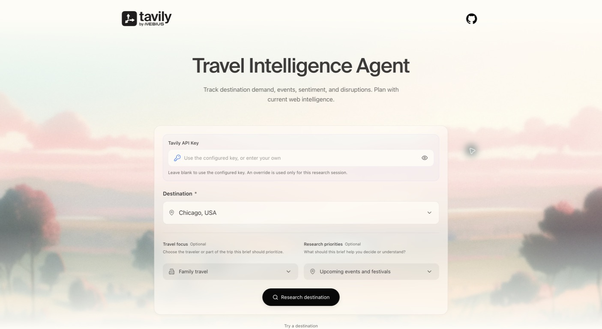

# Travel Intelligence Agent

A simple, source-backed research agent for travel and hospitality teams. Enter a destination to monitor demand signals, destination trends, events, local sentiment, and real-time disruption risks.



## What it does

- Runs four focused Tavily Search research lanes in parallel: destination demand, pricing and capacity, trends and events, and disruptions and sentiment.
- Uses an agentic loop: an LLM creates focused queries, Tavily retrieves and scores live web sources, the agent curates and extracts the strongest sources, then compiles a travel intelligence brief.
- Streams progress to the browser and exports the finished brief as a PDF.
- Supports a per-session Tavily API key and optional MongoDB persistence.

## Architecture

```text
React + Vite UI
      │  POST /research
      ▼
FastAPI application
      │
      ▼
Travel intelligence graph
  query agents → Tavily Search → curate → extract → brief → report
```

## Run locally

1. Install backend dependencies:

   ```bash
   uv venv .venv
   uv pip install -r requirements.txt
   ```

2. Create `.env` and set the model keys:

   ```env
   OPENAI_API_KEY=your_openai_key
   # Optional backend fallback. Visitors can also supply a session key in the UI.
   TAVILY_API_KEY=your_tavily_key
   # MONGODB_URI=optional_connection_string
   ```

3. Start the API:

   ```bash
   .venv/bin/uvicorn application:app --reload --port 8000
   ```

4. In another terminal, start the UI:

   ```bash
   cd ui
   npm install
   npm run dev
   ```

Open [http://localhost:5174](http://localhost:5174).

## API

`POST /research`

```json
{
  "destination": "Kyoto, Japan",
  "travel_segment": "Boutique hotels and guided tours",
  "source_market": "North America",
  "tavily_api_key": "tvly-..."
}
```

The response returns a job ID. Connect to `GET /research/{job_id}/stream` for live progress and the completed report.
